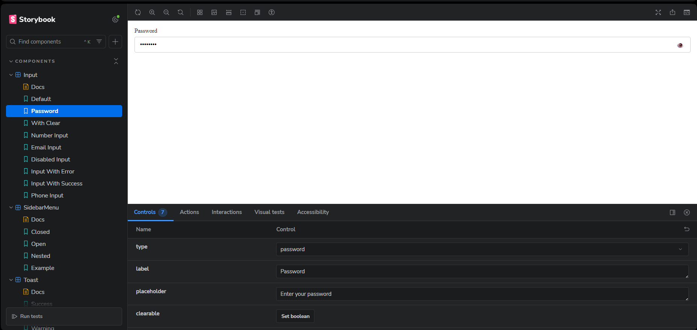
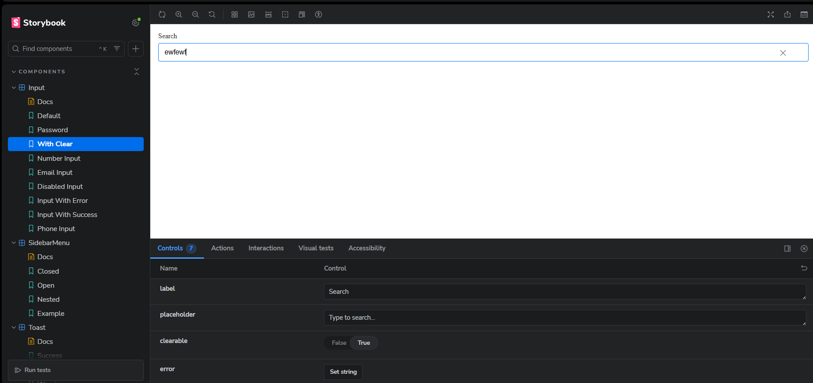
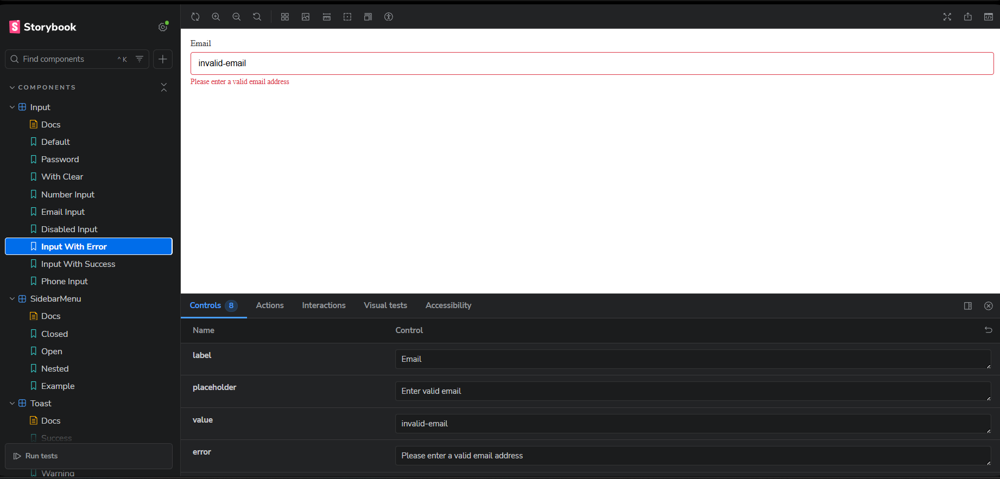
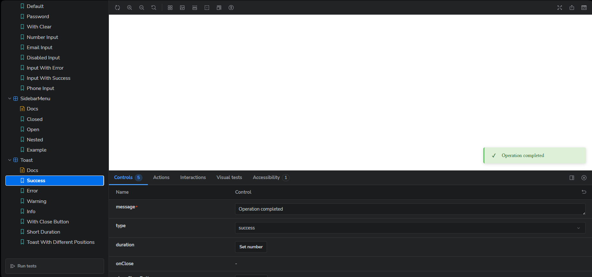
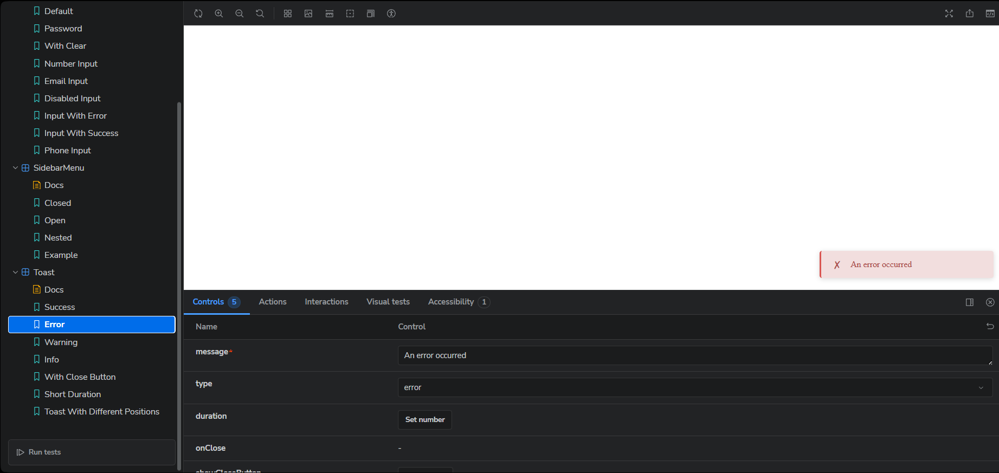
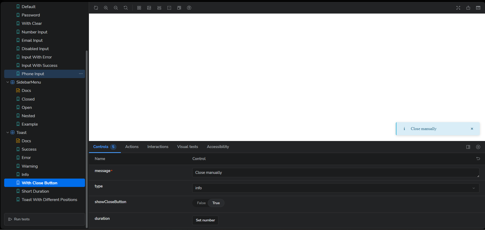
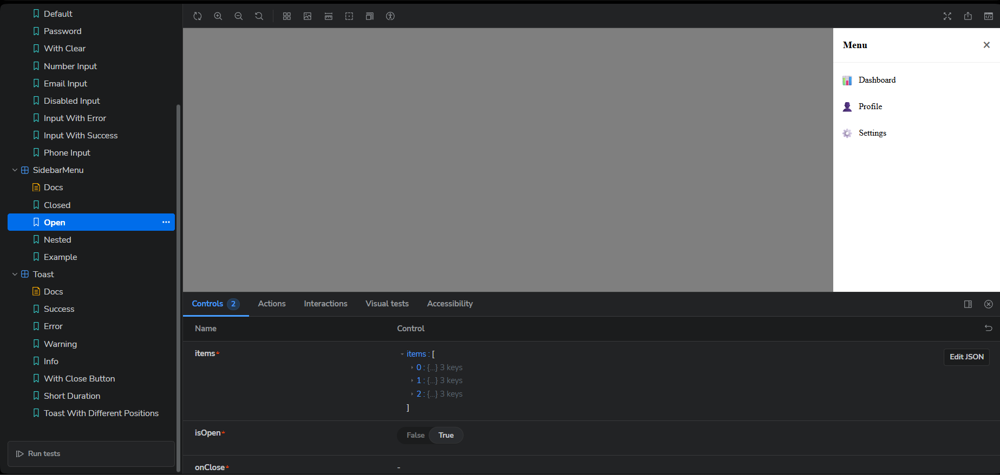
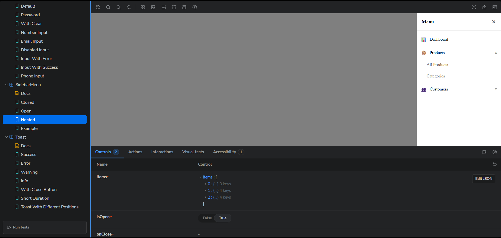

# React Component Library Test

## install and start
npm install
npm run storybook

## Screenshots
### Input Component

  
*Password input with visibility toggle button*

*Input with clear button (X)*

*Input with error message*

### Toast Component  

*Success toast notification*

*Toast with error message*

*Toast notification with ability to close*

### Sidebar Menu Component

*Opened sidebar menu*

*Open sidebar menu with nested items*
